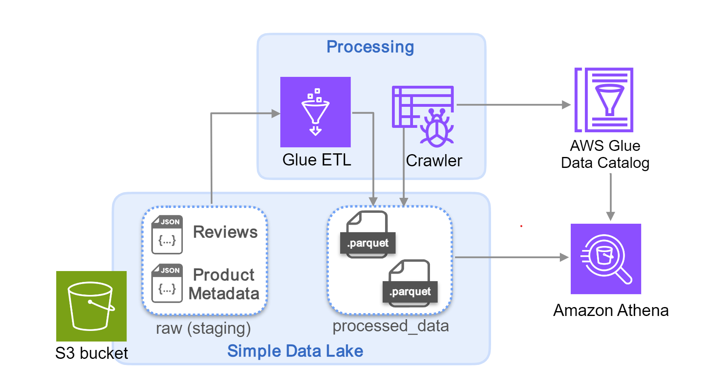

# Data Project Template

<a target="_blank" href="https://datalumina.com/">
    
</a>

## Project Organization

```
├── LICENSE            <- Open-source license if one is chosen
├── README.md          <- The top-level README for developers using this project
├── data
│   ├── external       <- Data from third party sources
│   ├── interim        <- Intermediate data that has been transformed
│   ├── processed      <- The final, canonical data sets for modeling
│   └── raw            <- The original, immutable data dump
│
├── models             <- Trained and serialized models, model predictions, or model summaries
│
├── notebooks          <- Jupyter notebooks. Naming convention is a number (for ordering),
│                         the creator's initials, and a short `-` delimited description, e.g.
│                         `1.0-jqp-initial-data-exploration`
│
├── references         <- Data dictionaries, manuals, and all other explanatory materials
│
├── reports            <- Generated analysis as HTML, PDF, LaTeX, etc.
│   └── figures        <- Generated graphics and figures to be used in reporting
│
└── src                         <- Source code for this project
    │
    ├── __init__.py             <- Makes src a Python module
    │
    ├── config.py               <- Store useful variables and configuration
    │
    ├── dataset.py              <- Scripts to download or generate data
    │
    ├── features.py             <- Code to create features for modeling
    │
    │
    ├── modeling
    │   ├── __init__.py
    │   ├── predict.py          <- Code to run model inference with trained models
    │   └── train.py            <- Code to train models
    │
    ├── plots.py                <- Code to create visualizations
    │
    └── services                <- Service classes to connect with external platforms, tools, or APIs
        └── __init__.py
```

## Project

'''
Assume you work as a Data Engineer at a retailer specializing in scale models of classic cars and other transportation. The data analysts are interested in conducting trend analysis for the top products reviewed in Amazon, to inform new product development. Recently, your team acquired Amazon toy review data and product info, and stored them in a data lake bucket. You are asked to clean the data and ensure its accessibility, so that the data analysts can retrieve the data with SQL-based queries. For the initial testing phase, the team has opted to use AWS Glue ETL for the initial data cleaning, and Amazon Athena to query the data.
'''

## Project Architecture


